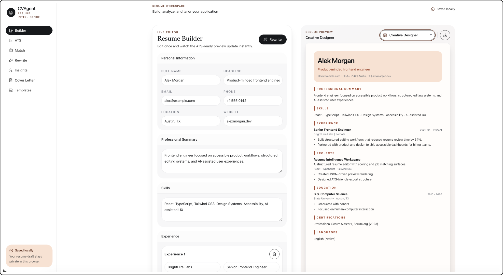
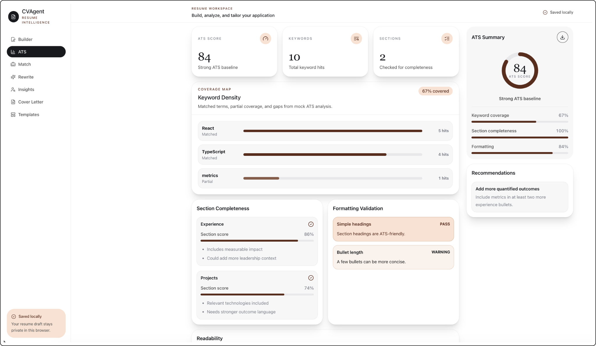
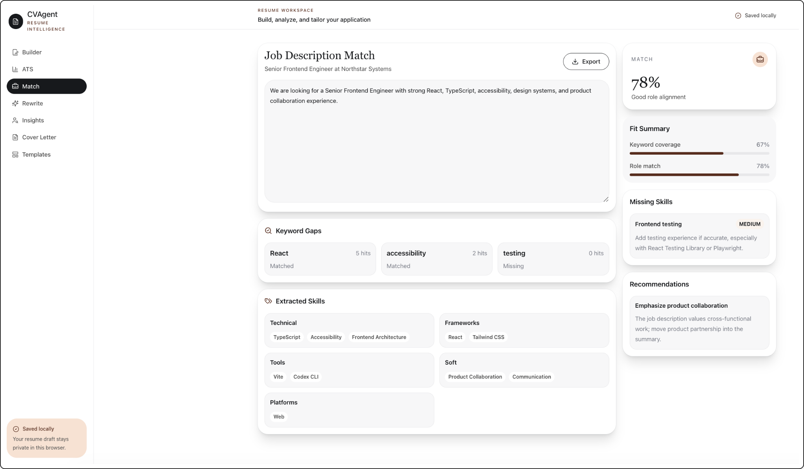
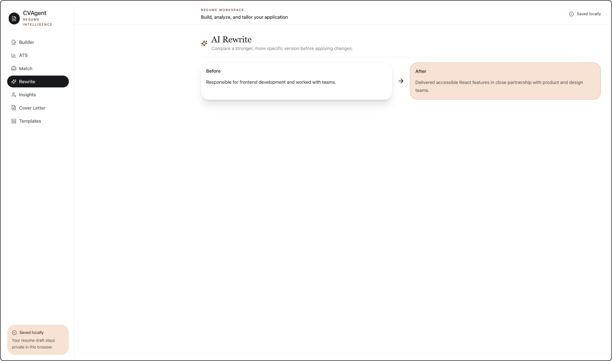
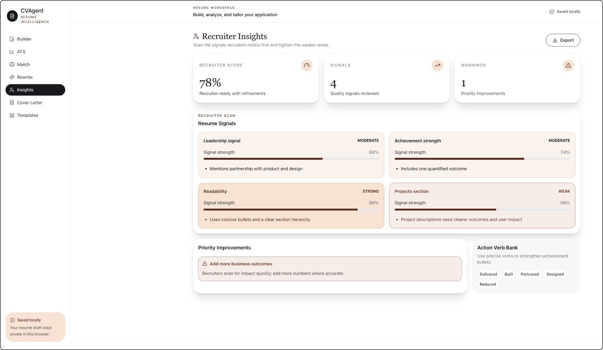
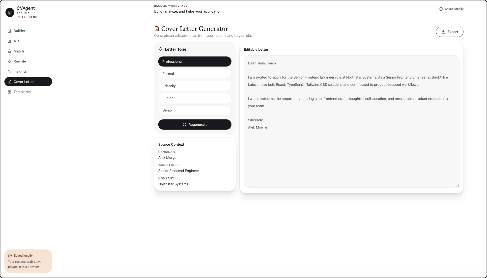
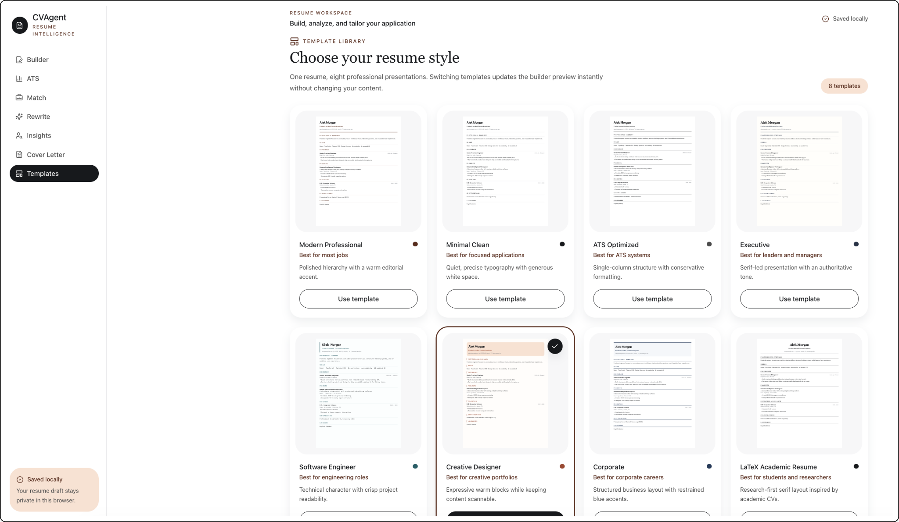

# CVAgent

CVAgent is a frontend-only AI resume workspace for editing, analyzing, and tailoring a resume in one place. It combines a structured editor, ATS feedback, job matching, recruiter insights, AI rewrites, a cover letter generator, and a reusable template library.

The app is designed as a polished SaaS-style product with structured JSON data, local browser persistence, and mock AI analysis flows that can be iterated quickly without backend infrastructure.

## Product Tour

The screenshots in [`assets/`](assets) show the main user flows across the app:

### Resume Builder

Split-screen editing with live preview and local draft persistence.



### ATS Dashboard

Score breakdown, keyword density, formatting checks, and recommendations.



### Job Match Analysis

Role fit scoring, keyword gaps, and extracted skills.



### AI Rewrite Comparison

Before/after resume rewrites for stronger bullet points.



### Recruiter Insights

Recruiter-facing signals, warnings, and action suggestions.



### Cover Letter Generator

Tone selection and editable letter output.



### Template Library

Eight visual resume templates with instant switching.



## What CVAgent Does

- Real-time split-screen resume editor and live preview
- Eight professional resume templates with instant switching
- ATS score dashboard with keyword density, readability, completeness, and formatting checks
- Job description matching with extracted keywords and missing-skill recommendations
- Recruiter insights with signal scoring, warnings, and action verb suggestions
- Cover letter generator with multiple tone options and editable output
- AI rewrite comparison UX
- Local storage persistence for resume drafts and template selection
- Markdown exports for resume, ATS report, recruiter insights, job matching, and cover letters

## Resume Templates

CVAgent uses one shared `ResumeData` JSON schema for every template. Switching templates changes presentation only; the resume content stays the same.

Available templates:

- Modern Professional
- Minimal Clean
- ATS Optimized
- Executive
- Software Engineer
- Creative Designer
- Corporate
- LaTeX Academic Resume

Template definitions live in [`src/templates/resumeTemplates`](src/templates/resumeTemplates), with a typed registry in [`registry.ts`](src/templates/resumeTemplates/registry.ts).

## Tech Stack

- React
- TypeScript
- Vite
- Tailwind CSS
- React Hook Form
- Axios
- Lucide React
- Local storage
- JSON seed data

## Getting Started

### Prerequisites

- Node.js 20+
- pnpm

### Install

```bash
pnpm install
```

### Run Locally

```bash
pnpm dev
```

Open the local URL printed by Vite, typically `http://localhost:5173`.

### Build

```bash
pnpm run build
```

### Lint

```bash
pnpm run lint
```

## Project Structure

```text
assets/               # Product screenshots used in this README
src/
├── components/       # Reusable UI and resume preview components
├── data/             # JSON seed data and mock analysis fixtures
├── hooks/            # Shared React hooks
├── layouts/          # Sidebar, header, dashboard, and split workspace layouts
├── pages/            # Product feature pages
├── services/         # Frontend mock AI services
├── store/            # Local storage helpers and persistence keys
├── styles/           # Tailwind entry point and print styles
├── templates/        # Markdown exports and resume template renderers
├── types/            # Shared TypeScript contracts
└── utils/            # Browser download helpers
```

## Template Architecture

Every visual resume template implements the same typed interface:

```ts
interface ResumeTemplateProps {
  resume: ResumeData;
}
```

The template registry maps template metadata to reusable React renderers. The Resume Builder reads the selected template from local storage and updates the preview immediately when users switch templates from either:

- The `Templates` gallery page
- The inline template selector beside the resume export actions

## Exporting Resumes

### Markdown

Use the Markdown export icon in the resume preview toolbar to download `resume.md`.
